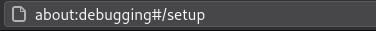
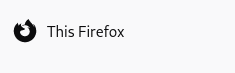
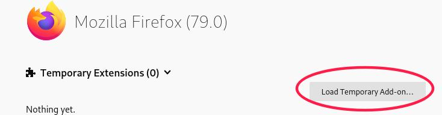
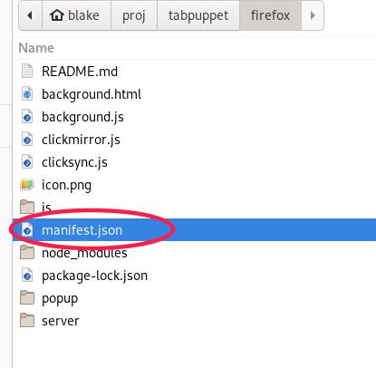
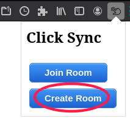

# TabPuppet

TabPuppet is a firefox add-on for synchronizing click events across browser instances. 
It works by establishing a peer-to-peer connection (via a WebRTC Data Channel) and sending 
the XPATH of any elements clicked at the "host" machine to any number of connected "client" machines (star topology).

## Progress

- [x] Establish a peer-to-peer connection using a signalling server
- [x] Mirror clicks from one tab to another via the peer-to-peer connection
- [x] Allow multiple clients to connect to join a room (create a star topology)
- [x] Automatically re-inject the content scripts (for monitoring and mirroring clicks) on page reload/redirect
    - note: does not work with host and client running in the same browser
- [x] Deploy signaling server to google cloud
- [ ] Allow for bi-directional synchronization as an option 
- [ ] Mirror other actions such as searches in the address bar
- [ ] Handle errors regarding host and clients becoming out of sync
- [ ] Add configuration of the start URL to the popup instead of using the current active tab's URL
- [ ] Allow multiple active sessions to be hosted from a single browser
- [ ] Allow clients to connect mid-session and load up with the same state as the host tab
- [ ] Notify peers when the host exits the room

## Installing

The add-on is currently only available by loading it as a temporary add-on in firefox.

First clone the repo.

```sh
git clone https://github.com/BlakeASmith/tabpuppet.git
```

Open **firefox** and type `about:debugging` into the address bar.



Next, click the "this firefox" button



Click `load temporary add-on` and navigate to the  file for the extension



-----



## Usage

### Sharing Your Tab / Hosting

Navigate to a website that you would like to start sharing from. Create a room by
clicking the `Create Room` button in the popup.



This will open the current website in a new tab, any clicks within the new tab will be 
replicated at the connected clients. 


The signalling server generates a token/key which others can use to join the session. The token is
only used to establish the peer-to-peer connection between your browser and the clients.


enter_key.png
hosting_room.png
join_room.png
load_manifest.jpg


